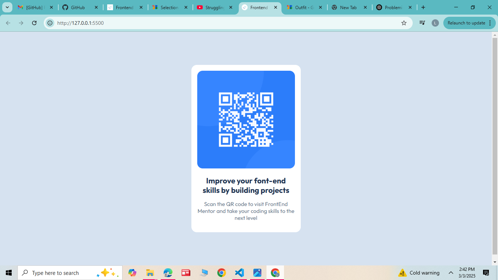

# Frontend Mentor - QR code component solution

This is a solution to the [QR code component challenge on Frontend Mentor](https://www.frontendmentor.io/challenges/qr-code-component-iux_sIO_H). 

## Table of contents

- [Overview](#overview)
  - [Screenshot](#screenshot)
  - [Links](#links)
- [My process](#my-process)
  - [Built with](#built-with)
  - [What I learned](#what-i-learned)
  - [Continued development](#continued-development)
  - [Useful resources](#useful-resources)
- [Author](#author)

## Overview
This project is a solution to the QR Code Component Challenge on Frontend Mentor. The goal was to create a simple and responsive QR code card using HTML and CSS.

The design follows best practices, including:
A clean and centered layout
Use of CSS Flexbox for alignment
Responsive design for different screen sizes


### Screenshot




### Links

- Solution URL: [Add solution URL here](https://your-solution-url.com)
- Live Site URL: [Add live site URL here](https://your-live-site-url.com)

### Built with

- Semantic HTML5 markup
- CSS custom properties
- Flexbox

### What I learned

During this project, I improved my skills in styling elements with CSS and using variables for colors. Below is a snippet of the CSS code I used
To see how you can add code snippets, see below:

```css
.container {
    background-color: var(--white);
    border-radius: 5%;
    padding: 20px;
    max-width: 320px;
    text-align: center;
    box-shadow: 0 4px 8px rgba(0, 0, 0, 0.1);
}
```

### Continued development

In the future, I would like to add more animations and effects to make the design more dynamic and engaging.

### Useful resources

- [Css Tricks](https://css-tricks.com/) - A great resource for advanced CSS techniques.
- [Google Fonts](https://fonts.google.com/) -  Used to get the "Outfit" font for this project.

## Author

- Frontend Mentor - [@leamurturi4]


